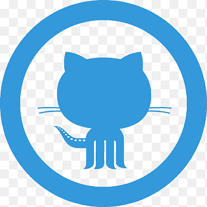

<h1> 

<p align="center" >Hello, 👋 Samarpan Dasgupta here </h1>

<h3 align="center"><i>A Passionate Developer from India</i></h3></br></br>

[](https://github.com/SamarpanCoder2002) [](https://github.com/SamarpanCoder2002) [](https://github.com/SamarpanCoder2002?tab=followers) [](https://github.com/SamarpanCoder2002) 
<!-- [](https://badges.pufler.dev/repos/SamarpanCoder2002) -->
[](https://www.linkedin.com/in/samarpan-dasgupta-4aa1061b0/)
[](https://www.youtube.com/channel/UCafv0dsb4Xp8sSWoKdmw5BQ)
<br></br>

<!-- - 🔭 **_I'm in the Second Year of BSC Computer Science Hons._**</br> -->
- 🙋 **_Visit My Portfolio https://www.samarpandasgupta.com_**
- 😲 **_Now Working as a Full Time Software Developer_**</br>
- 🎊 **_I'm a Flutter and MERN/FERN Stack Developer_**</br>
- 🌱 **_Also Working on Some of My Personal Projects._**</br>
- ⚡ **_Fun fact: I am still single._** 😂</br>
- <b>📫 How to reach me :<a href="https://mail.google.com/mail/?view=cm&fs=1&to=samarpanofficial2021@gmail.com"> samarpanofficial2021@gmail.com</a></b>
<br/>

- <b>🔗 Connect with me :</b>
<br/>
<a href="https://www.linkedin.com/in/samarpan-dasgupta-4aa1061b0/">  </a>&nbsp;&nbsp;<a href="https://www.facebook.com/samarpan.dasgupta.3/">  </a>&nbsp;&nbsp;<a href="https://www.instagram.com/samarpan_dasgupta/">  </a>&nbsp;&nbsp;<a href="https://twitter.com/SamarpanDasgup1">  </a>&nbsp;&nbsp;<a href="https://www.youtube.com/channel/UCafv0dsb4Xp8sSWoKdmw5BQ">  </a>

### 💘 Github Stats:-

[](https://github.com/SamarpanCoder2002/github-readme-stats)

</br>

### 💘 Most Used Languages:-

[](https://github.com/SamarpanCoder2002/github-readme-stats)

</br>

### 💘 Github Trophies:-

[](https://github.com/SamarpanCoder2002/github-profile-trophy)

</br>

### 💘 Github Activity Graph:-

[](https://github.com/SamarpanCoder2002/github-readme-activity-graph)

<h3> <p align="center"> Show ❤️ by Starring(⭐) Some of my Repos</h3>

```Javascript 
console.log("What You Seek is Seeking You")
```

</br>

<h3> ⚒️ Tools and Programming Languages:- </h3>
<p align="left">


&nbsp&nbsp
&nbsp&nbsp
&nbsp&nbsp


</p>
<br/>

<h3>🌱 My Latest Youtube Videos</h3>

- #### [Generation 2.0 - Simple, Secure, User-Friendly Modern Messaging app](https://youtu.be/4MvZaJJ-qeE)

- #### [Flutter Social Media Chat App Tutorial Playlist](https://youtube.com/playlist?list=PLn4o1Gy6eg752X6ZaJ7UL55kLJ235laOg)

- #### [Flutter RealTime Chat App](https://youtu.be/QEDhmxzEqUA)

- #### [Flutter E-Commerce App Clone](https://youtu.be/nxZa9D8_wrc)

- #### [AI Ludo Game Made In Python Tkinter](https://youtu.be/5NScX6qgd3Y)

[youtube]: https://www.youtube.com/channel/UCafv0dsb4Xp8sSWoKdmw5BQ
[linkedin]: https://www.linkedin.com/in/samarpan-dasgupta-4aa1061b0/
